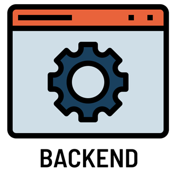
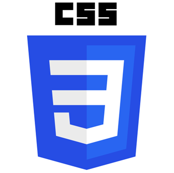

<h1 align="center">Hi 👋, I'm Gabriela</h1>

<h3 align="left">A passionate self-taught Software Engineer</h3>

- 🔭 I’m currently working on becoming a Full Stack Developer

- 🌱 I’m currently learning Angular, Node.js and Python

- 💬 Ask me about Software Development Lifecycle, Java, APIs, Microservices, Backend Development

- 👯 I’m looking to collaborate on all kinds of projects

- 📫 How to reach me gabi.ks88@gmail.com

- ⚡ Fun fact: I love working with numbers

<h2 align="center">Connect with me:</h2>

Feel free to reach me on any of these:

&emsp;
&emsp;

 

<h2 align="center">Languages and Tools:</h2>

I am well experienced working with these tools:

 

	&emsp;
	&emsp;
	&emsp;
	&emsp;

	&emsp;
	&emsp;
	&emsp;
	&emsp;
	&emsp;

 