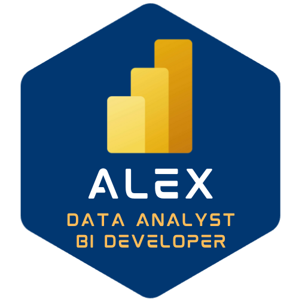
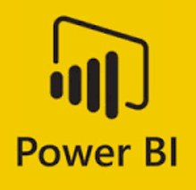
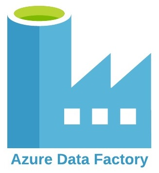
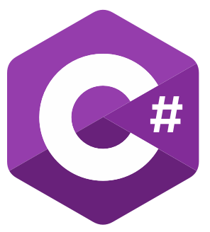
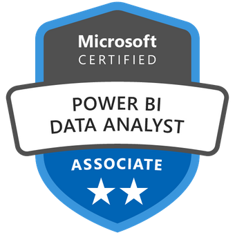
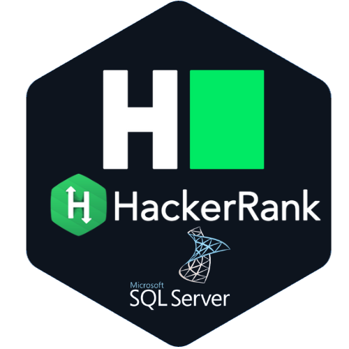

<h1 align="center">Hi 👋, I'm Alex</h1>

<h3 align="left">A passionate self-taught Data/Business Intelligence Analyst</h3>

- 🔭 I’m currently working on becoming a Business Intelligence Developer

- 🌱 I’m currently learning Python and Microsoft SQL Server, SSRS, SSAS, SSIS

- 💬 Ask me about Business Intelligence, MySQL, Data Analytics, Power BI

- 👯 I’m looking to collaborate on all kinds of projects and open for BI consultations

- 📫 How to reach me rodrigo.mangueiras@gmail.com

- ⚡ Fun fact: I love working with numbers

<h2 align="center">Connect with me:</h2>

Feel free to reach me on any of these:

&emsp;
&emsp;

 

<h2 align="center">Languages and Tools:</h2>

I am well experienced working with these tools:

	&emsp;
	&emsp;
	&emsp;
	&emsp;

asdsadad

 

	&emsp;
	&emsp;
	&emsp;
	&emsp;

 

	&emsp;
	&emsp;
	&emsp;

 

<h2 align="center">Certifications:</h2>

I am well experienced working with these tools:

  
&emsp;
&emsp;
&emsp;
&emsp;

 

<h2 align="center">Badges:</h2>

I am well experienced working with these tools:

  
&emsp;
&emsp;
&emsp;
&emsp;

 

<h2 align="center">What I do:</h2>
 
Data Visualizations and Data Storytelling with Power BI, Google Data Studio and Tableau
 
					   
Data preparation, Data cleaning and Data manipulation
 
					
Data Mining and Querying with MySQL and Microsoft SQL Server
 
					   
BI support and  insight generation that proves valuable to business stakeholders

					    
Qualitative and Quantitative Analysis, Market Analysis via Competitor Comperative Tests, Product Analysis

						
Data Analytics and Business Intelligence

						
Technical training, Design Thinking, Decision Support, Problem Solving, Research and Development 

					        
Performance Metrics, KPI's and Benchmarking

					    
Zoho CRM, Zoho Analytics, Zoho Survey Administration, troubleshooting and maintainance

					
I am knowlegeable in Datawarehousing, ETL, DAX, SSAS, SSIS, SSRS, Customer lifetime value (CLV), Converstion rates

   
  

### Show some ❤️ by starring some of the repositories!

  

<!--

- :chart_with_downwards_trend:
- 🔭 I’m currently working on .
- 🌱 I’m currently learning ...
- 👯 I’m looking to collaborate on ...
- 🤔 I’m looking for help with ...
- 💬 Ask me about ...
- 📫 How to reach me: ...
- 😄 Pronouns: ...
- ⚡ Fun fact: ...
-->
